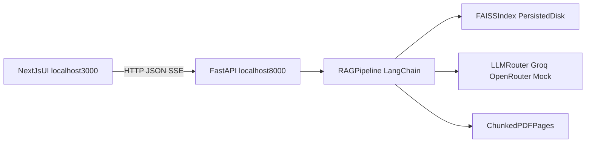
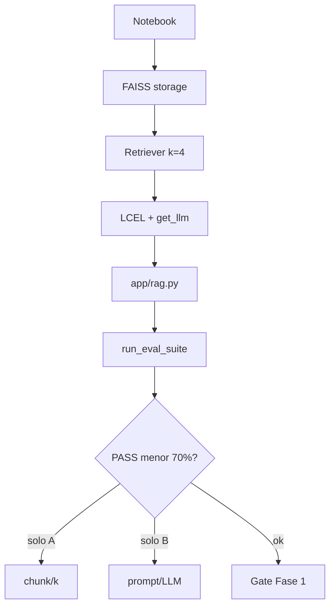

# Plan de implementación: RAG-LIBRO

## Objetivo

Construir en este proyecto una solución RAG funcional sobre el PDF **"30 Agents Every AI Engineer Must Build"**, con arquitectura separada (Python API + UI web), evaluación medible desde el inicio y trazabilidad de decisiones para entrevistas técnicas.

## Alcance y criterio de éxito

- Crear la base del proyecto en una carpeta nueva: `[C:\Users\Dell\Agus\Ai Agents Imran Ahmad\RAG-LIBRO](C:\Users\Dell\Agus\Ai Agents Imran Ahmad\RAG-LIBRO)`.
- Entregar backend FastAPI con endpoints `/health`, `/chat`, `/chat/stream`.
- Entregar frontend Next.js con chat streaming y fuentes (páginas) visibles.
- Definir y usar `EVAL.md` antes de implementar el core RAG.
- Alcanzar baseline de evaluación: al menos 70% de queries aprobadas.

## Arquitectura objetivo




## Fases


```markdown
## Metodología — skill `senior-ai-engineer-mentor`

**Regla global**: en cada sesión de desarrollo (Fase 0 → 5), el agente debe **leer y aplicar** la skill [`senior-ai-engineer-mentor`](C:\Users\Dell\.agents\skills\senior-ai-engineer-mentor\SKILL.md) antes de implementar.

| Principio | Qué implica en la práctica |
|-----------|---------------------------|
| **CONCEPTS > CODE** | Explicar el *por qué* antes del snippet; no volcar soluciones completas sin que hayas corrido/entendido el paso anterior |
| **Libro = gimnasio** | Cruzar cada paso con capítulos del repo `30-Agents-Every-AI-Engineer-Must-Build` (sobre todo cap 06 para RAG, cap 02/04 según fase) |
| **Evidencia de mastery** | Tras cada fase, actualizar Engram (`mem_save`) con nivel `explored` → `practiced` según evidencia real |
| **Gates obligatorios** | No avanzar de fase sin pasar el *gate* de esa fase (ver tabla abajo) |

**Comandos útiles durante el proyecto**

- `/ai-mentor` — fuerza modo mentor aunque el mensaje sea operativo (“creá el endpoint”)
- `review` + tu código — feedback quirúrgico post-implementación
- `interview {concepto}` — simulacro antes de cerrar una fase (ej. `interview chunking-strategy`)
- `/no-mentor` — un solo turno sin mentoría (solo cuando necesitás velocidad pura)
```


### Fase 0 — Scaffold inicial

- Crear carpeta raíz `[C:\Users\Dell\Agus\Ai Agents Imran Ahmad\RAG-LIBRO](C:\Users\Dell\Agus\Ai Agents Imran Ahmad\RAG-LIBRO)`.
- Crear estructura base:
  - `[C:\Users\Dell\Agus\Ai Agents Imran Ahmad\RAG-LIBRO\backend](C:\Users\Dell\Agus\Ai Agents Imran Ahmad\RAG-LIBRO\backend)`
  - `[C:\Users\Dell\Agus\Ai Agents Imran Ahmad\RAG-LIBRO\frontend](C:\Users\Dell\Agus\Ai Agents Imran Ahmad\RAG-LIBRO\frontend)`
  - `[C:\Users\Dell\Agus\Ai Agents Imran Ahmad\RAG-LIBRO\backend\app](C:\Users\Dell\Agus\Ai Agents Imran Ahmad\RAG-LIBRO\backend\app)
  - `[C:\Users\Dell\Agus\Ai Agents Imran Ahmad\RAG-LIBRO\backend\tests](C:\Users\Dell\Agus\Ai Agents Imran Ahmad\RAG-LIBRO\backend\tests)
  - `[C:\Users\Dell\Agus\Ai Agents Imran Ahmad\RAG-LIBRO\backend\data](C:\Users\Dell\Agus\Ai Agents Imran Ahmad\RAG-LIBRO\backend\data)
  - `[C:\Users\Dell\Agus\Ai Agents Imran Ahmad\RAG-LIBRO\backend\storage](C:\Users\Dell\Agus\Ai Agents Imran Ahmad\RAG-LIBRO\backend\storage)
- Crear archivos base: `.gitignore`, `.env.example`, `README.md`, `EVAL.md`.
- Inicializar entorno Python y `requirements.txt` alineado a LangChain 0.3+.
- Incorporar MockLLM reutilizable desde capítulo 06 como fallback offline.

### Fase 0.5 — Evaluación primero (eval-first)

- Diseñar `EVAL.md` con 10 queries (fáciles, medias, cross-chapter).
- Definir criterios binarios por query:
  - Recuperación de páginas esperadas en top-k.
  - Presencia mínima de conceptos clave en respuesta.
- Crear esqueleto de test en `[C:\Users\Dell\Agus\Ai Agents Imran Ahmad\RAG-LIBRO\backend\tests\test_eval.py](C:\Users\Dell\Agus\Ai Agents Imran Ahmad\RAG-LIBRO\backend\tests\test_eval.py)`.
- Completar páginas esperadas con inspección real del PDF (sin inventar referencias).

### Fase 1 — Core RAG en notebook

**Estado previo (Fase 0):** [`RAG-LIBRO/backend/app/llm.py`](RAG-LIBRO/backend/app/llm.py) ya tiene `get_llm()` con `groq | openrouter | mock` + fallback. En 1.10 solo **verificar** integración con LCEL, no reimplementar.

**Requisito crítico:** chunks con **página PDF 1-based** en metadata (`PyPDFLoader` usa `page` 0-based → +1 al evaluar criterio A).

**Gate de fase:** `pass_rate >= 0.70` en [`run_eval_suite`](RAG-LIBRO/backend/tests/test_eval.py) con embeddings reales; notebook reproducible; [`app/rag.py`](RAG-LIBRO/backend/app/rag.py) listo para Fase 2.

#### Bloque A — Notebook e ingestión (fase-1a)

| ID | Tarea | Gate |
|----|-------|------|
| 1.1 | Scaffold [`backend/notebooks/rag_exploration.ipynb`](RAG-LIBRO/backend/notebooks/rag_exploration.ipynb): paths, `load_dotenv`, check PDF | Kernel + ~542 páginas |
| 1.2 | Load con `PyPDFLoader`; inspeccionar `metadata` (`page`, `source`) | `len(docs)` = páginas PDF |
| 1.3 | `RecursiveCharacterTextSplitter` 1000/200; propagar `page` a cada chunk | chunks > 0, metadata ok |

#### Bloque B — Índice FAISS (fase-1b)

| ID | Tarea | Gate |
|----|-------|------|
| 1.4 | `HuggingFaceEmbeddings(all-MiniLM-L6-v2)` — **no** MockEmbeddings para eval A | vector dim estable |
| 1.5 | `FAISS.from_documents` → `backend/storage/faiss_index/` | carpeta persistida |
| 1.6 | Carga idempotente (`REBUILD_INDEX`); `load_local` si existe | 2ª corrida sin re-embedear |

#### Bloque C — Retriever y LCEL (fase-1c)

| ID | Tarea | Gate |
|----|-------|------|
| 1.7 | Retriever `k=4`; smoke Q01/Q05 con páginas 1-based en top-k | Q05: p.180–181 en top-4 |
| 1.8 | `ChatPromptTemplate` (solo contexto, citar páginas, “no sé”) + `format_docs` | prompt renderizado ok |
| 1.9 | Chain LCEL: retriever → prompt → `get_llm()` → `StrOutputParser()` | respuesta + `list[int]` páginas |
| 1.10 | Verificar `get_llm(provider=...)` desde notebook; `pytest test_llm_fallback.py` verde | wiring LLM ok |

#### Bloque D — Módulo `rag.py` (fase-1d)

| ID | Tarea | Gate |
|----|-------|------|
| 1.11 | Crear [`app/rag.py`](RAG-LIBRO/backend/app/rag.py): `build_or_load_vectorstore`, `get_retriever`, `answer_with_sources(query, k) -> {answer, pages}` | import desde `backend/` |
| 1.12 | Notebook importa `app.rag` (sin duplicar lógica) | misma salida notebook vs módulo |

Contrato para tests: [`test_eval.py`](RAG-LIBRO/backend/tests/test_eval.py) L102–104 espera `answer_with_sources`.

#### Bloque E — Eval y tuning (fase-1e)

| ID | Tarea | Gate |
|----|-------|------|
| 1.13 | `run_eval_suite` en notebook; tabla A/B por query | PASS rate calculado |
| 1.14 | `pytest tests/test_eval.py -m integration -v` | harness corre |
| 1.15 | Diagnóstico por FAIL: solo A → retrieval; solo B → prompt/LLM | patrón documentado |
| 1.16 | Tuning retrieval (una var.): `k` 4→6→8, `chunk_size` 1000→800, `overlap` 200→300 | mejora en cross-chapter |
| 1.17 | Tuning generación si A ok: prompt estricto, `temperature`, modelo real (no mock para B) | B pasa con proveedor real |
| 1.18 | Actualizar [`EVAL.md`](RAG-LIBRO/EVAL.md) + ADR-06 en [`PROJECT_OVERVIEW.md`](RAG-LIBRO/PROJECT_OVERVIEW.md); Engram `practiced` | **≥70%** PASS |



**Fuera de Fase 1:** FastAPI/SSE/singleton → Fase 2.

### Fase 2 — FastAPI + SSE

- Conectar [`RAG-LIBRO/backend/app/rag.py`](RAG-LIBRO/backend/app/rag.py) (creado en Fase 1) a la API.
- Implementar API en `[C:\Users\Dell\Agus\Ai Agents Imran Ahmad\RAG-LIBRO\backend\app\main.py](C:\Users\Dell\Agus\Ai Agents Imran Ahmad\RAG-LIBRO\backend\app\main.py)`:
  - `GET /health`
  - `POST /chat` (sync)
  - `POST /chat/stream` (SSE: token, sources, done)
- Configurar CORS para `http://localhost:3000`.
- Cargar pipeline una sola vez en startup (lifespan singleton).

### Fase 3 — Frontend Next.js

- Scaffold Next.js 14 + Tailwind + componentes de UI.
- Construir chat con estado `idle | streaming | done | error`.
- Consumir SSE por POST con `@microsoft/fetch-event-source`.
- Renderizar fuentes/páginas como badges al cierre de respuesta.

### Fase 4 — Documento de defensa técnica

- Crear `[C:\Users\Dell\Agus\Ai Agents Imran Ahmad\RAG-LIBRO\PROJECT_OVERVIEW.md](C:\Users\Dell\Agus\Ai Agents Imran Ahmad\RAG-LIBRO\PROJECT_OVERVIEW.md)` (gitignored).
- Documentar decisiones, trade-offs, limitaciones y plan de escalado.
- Mantenerlo actualizado durante el desarrollo, no solo al final.

### Fase 5 — Cierre y validación end-to-end

- Consolidar `README.md` con arquitectura, setup y decisiones técnicas.
- Verificar:
  - tests backend
  - `/docs` de FastAPI
  - llamadas sync y streaming
  - flujo completo UI -> API -> RAG
- Preparar evidencia de portfolio (historial de fases, tags y resultados de eval).

## Estrategia Git y entregables

- Branch por fase: `fase-0` a `fase-5-readme`.
- Commits con conventional commits (`feat`, `fix`, `docs`, `test`, `chore`).
- PR por fase con squash merge y actualización de README.
- Mantener secretos fuera de git (`.env`), comitear solo `.env.example`.

## Riesgos y mitigaciones

- Riesgo: bajo rendimiento inicial del retrieval.
  - Mitigación: ajuste iterativo de `chunk_size`, `chunk_overlap`, `k`, prompt y comparación Groq/OpenRouter.
- Riesgo: latencia alta en generación.
  - Mitigación: SSE + carga singleton + opción de proveedor alterno.
- Riesgo: calidad no medible.
  - Mitigación: `EVAL.md` y `test_eval.py` desde el inicio.

## Orden de ejecución recomendado

1. Fase 0
2. Fase 0.5
3. Fase 1
4. Fase 2
5. Fase 3
6. Fase 4
7. Fase 5

