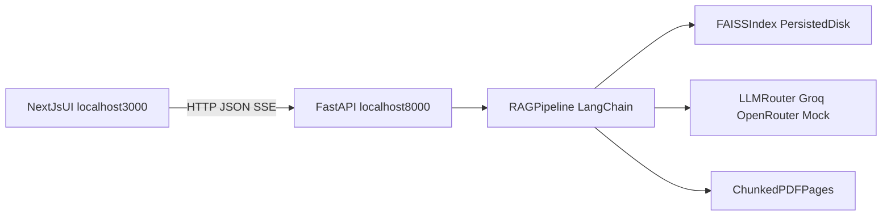

# Plan de implementación: RAG-LIBRO

## Objetivo
Construir en este proyecto una solución RAG funcional sobre el PDF **"30 Agents Every AI Engineer Must Build"**, con arquitectura separada (Python API + UI web), evaluación medible desde el inicio y trazabilidad de decisiones para entrevistas técnicas.

**Objetivo pedagógico**: aprender haciendo — no solo entregar código, sino poder explicar tradeoffs, anti-patterns y decisiones de diseño como un Applied AI Engineer.

## Metodología — skill `senior-ai-engineer-mentor`

**Regla global**: en cada sesión de desarrollo (Fase 0 → 5), el agente debe **leer y aplicar** la skill [`senior-ai-engineer-mentor`](C:\Users\Dell\.agents\skills\senior-ai-engineer-mentor\SKILL.md) antes de implementar.

| Principio | Qué implica en la práctica |
|-----------|---------------------------|
| **CONCEPTS > CODE** | Explicar el *por qué* antes del snippet; no volcar soluciones completas sin que hayas corrido/entendido el paso anterior |
| **Libro = gimnasio** | Cruzar cada paso con capítulos del repo `30-Agents-Every-AI-Engineer-Must-Build` (sobre todo cap 06 para RAG, cap 02/04 según fase) |
| **Evidencia de mastery** | Tras cada fase, actualizar Engram (`mem_save`) con nivel `explored` → `practiced` según evidencia real |
| **Gates obligatorios** | No avanzar de fase sin pasar el *gate* de esa fase (ver tabla abajo) |

**Comandos útiles durante el proyecto**

- `/ai-mentor` — fuerza modo mentor aunque el mensaje sea operativo (“creá el endpoint”)
- `review` + tu código — feedback quirúrgico post-implementación
- `interview {concepto}` — simulacro antes de cerrar una fase (ej. `interview chunking-strategy`)
- `/no-mentor` — un solo turno sin mentoría (solo cuando necesitás velocidad pura)

**Hitos del catálogo que cubre este proyecto**

| Hito | Archivo mentor | Fases del plan |
|------|----------------|----------------|
| 2 — RAG + MCP | `milestones/02-rag-mcp.md` | 0.5, 1 |
| 3 — APIs / streaming | `milestones/03-apis-microservices.md` | 2, 3 |
| 6 — Producción / evals | `milestones/06-production.md` | 0.5, 5 |

**Gates por fase (no negociables)**

| Fase | Gate pedagógico | Conceptos Engram (slugs) |
|------|-----------------|--------------------------|
| 0 | Explicás en 1 min qué hace cada carpeta del scaffold y por qué el PDF no va a git | — |
| 0.5 | Definís evals sin mirar código; explicás criterio A vs B (retrieval vs answer) | `evals-basics` (hito 6) |
| 1 | **Feynman 2 min**: los 6 pasos load→generate; EVAL ≥70% | `chunking-strategy`, `embeddings`, `vector-search` |
| 2 | Explicás CORS, lifespan singleton y por qué SSE vs polling; curl streaming OK | `sse-streaming`, `async-patterns` (hito 3) |
| 3 | Explicás por qué `EventSource` nativo no alcanza con POST | `sse-streaming` |
| 4 | Podés defender el proyecto 5 min sin abrir código (usa `PROJECT_OVERVIEW.md`) | proyecto → `skill/ai-engineer-mentor/projects/rag-libro` |
| 5 | `interview` sobre 2 conceptos elegidos al azar + demo E2E | subir conceptos a `practiced` donde aplique |

## Alcance y criterio de éxito
- Crear la base del proyecto en una carpeta nueva: `[C:\Users\Dell\Agus\Ai Agents Imran Ahmad\RAG-LIBRO](C:\Users\Dell\Agus\Ai Agents Imran Ahmad\RAG-LIBRO)`.
- Entregar backend FastAPI con endpoints `/health`, `/chat`, `/chat/stream`.
- Entregar frontend Next.js con chat streaming y fuentes (páginas) visibles.
- Definir y usar `EVAL.md` antes de implementar el core RAG.
- Alcanzar baseline de evaluación: al menos 70% de queries aprobadas.

## PDF del libro (rutas)

| Rol | Ruta |
|-----|------|
| **Origen (tu máquina)** | `C:\Users\Dell\Downloads\30 Agents Every AI Engineer Must Build Build production-ready agent systems using proven architectures and patterns (Imran Ahmad) (z-library.sk, 1lib.sk, z-lib.sk).pdf` |
| **Destino en el proyecto** | `RAG-LIBRO\backend\data\libro.pdf` (gitignored — no subir al repo público) |

En Fase 0, copiar el PDF al destino con nombre corto `libro.pdf` para simplificar código y tests. En PowerShell:

```powershell
New-Item -ItemType Directory -Force -Path "RAG-LIBRO\backend\data"
Copy-Item -LiteralPath "C:\Users\Dell\Downloads\30 Agents Every AI Engineer Must Build Build production-ready agent systems using proven architectures and patterns (Imran Ahmad) (z-library.sk, 1lib.sk, z-lib.sk).pdf" -Destination "RAG-LIBRO\backend\data\libro.pdf"
```

Usar `-LiteralPath` porque el nombre del archivo original tiene paréntesis y comas. El loader del RAG apuntará siempre a `backend/data/libro.pdf`.

## Arquitectura objetivo


## Fases

### Fase 0 — Scaffold inicial

**Mentor (antes de codear)**: ¿por qué separar `backend/` y `frontend/`? ¿qué gap de carrera cubre una API REST entre ambos?

**Mentor (después)**: gate — explicá estructura de carpetas sin leer `README`.

- Crear carpeta raíz `[C:\Users\Dell\Agus\Ai Agents Imran Ahmad\RAG-LIBRO](C:\Users\Dell\Agus\Ai Agents Imran Ahmad\RAG-LIBRO)`.
- Crear estructura base:
  - `[C:\Users\Dell\Agus\Ai Agents Imran Ahmad\RAG-LIBRO\backend](C:\Users\Dell\Agus\Ai Agents Imran Ahmad\RAG-LIBRO\backend)`
  - `[C:\Users\Dell\Agus\Ai Agents Imran Ahmad\RAG-LIBRO\frontend](C:\Users\Dell\Agus\Ai Agents Imran Ahmad\RAG-LIBRO\frontend)`
  - `RAG-LIBRO\backend\app`
  - `RAG-LIBRO\backend\tests`
  - `RAG-LIBRO\backend\data`
  - `RAG-LIBRO\backend\storage`
- Crear archivos base: `.gitignore`, `.env.example`, `README.md`, `EVAL.md`.
- Inicializar entorno Python y `requirements.txt` alineado a LangChain 0.3+.
- Incorporar MockLLM reutilizable desde capítulo 06 como fallback offline.
- **Copiar PDF** desde Downloads → `backend/data/libro.pdf` (ver sección [PDF del libro](#pdf-del-libro-rutas)).

### Fase 0.5 — Evaluación primero (eval-first)

**Mentor**: cargar `milestones/06-production.md` (sección evals). Anti-pattern: tunear sin métrica. Leer `playbooks/anti-patterns.md` si el agente sugiere “probar a ojo”.

**Mentor (después)**: `review` del borrador de `EVAL.md` — ¿las queries son binarias? ¿mezclás retrieval y calidad de respuesta?

- Diseñar `EVAL.md` con 10 queries (fáciles, medias, cross-chapter).
- Definir criterios binarios por query:
  - Recuperación de páginas esperadas en top-k.
  - Presencia mínima de conceptos clave en respuesta.
- Crear esqueleto de test en `[C:\Users\Dell\Agus\Ai Agents Imran Ahmad\RAG-LIBRO\backend\tests\test_eval.py](C:\Users\Dell\Agus\Ai Agents Imran Ahmad\RAG-LIBRO\backend\tests\test_eval.py)`.
- Completar páginas esperadas hojeando `backend/data/libro.pdf` (sin inventar referencias).

### Fase 1 — Core RAG en notebook

**Mentor**: cargar `milestones/02-rag-mcp.md` **on-demand** por paso (chunking → embeddings → vector-search). Referencia libro: `chapter06/ch06_knowledge_agents.ipynb` + `mock_llm_layer.py`.

**Ritmo aprender-haciendo** (una celda / concepto a la vez):

1. Implementar → ejecutar → inspeccionar output → explicar en voz alta → recién ahí siguiente paso.
2. Tras cada paso del pipeline, el mentor hace **1 pregunta tipo entrevista** (ver banco en `02-rag-mcp.md`).
3. Si EVAL <70%: mentor guía diagnóstico (¿chunking, embedding o retrieval?) — no solo “subí k”.

**Mentor (cierre fase)**: Feynman 2 min + comparar Groq vs OpenRouter en `EVAL.md` + `mem_save` mastery.

- Implementar exploración guiada en notebook:
  - Load con PyPDFLoader.
  - Split con RecursiveCharacterTextSplitter (1000/200 inicial).
  - Embeddings locales con `all-MiniLM-L6-v2`.
  - FAISS persistente a disco.
  - Retriever `k=4` inicial.
  - Chain LCEL con prompt y parser de salida.
- Implementar switch de proveedor LLM en `[C:\Users\Dell\Agus\Ai Agents Imran Ahmad\RAG-LIBRO\backend\app\llm.py](C:\Users\Dell\Agus\Ai Agents Imran Ahmad\RAG-LIBRO\backend\app\llm.py)` para `groq | openrouter | mock`.
- Ejecutar evaluación y ajustar parámetros hasta alcanzar >=70%.

### Fase 2 — FastAPI + SSE

**Mentor**: cargar `milestones/03-apis-microservices.md` (SSE, async, lifespan). Gap explícito: primera API HTTP — explicar request/response, CORS, por qué singleton al startup.

**Mentor (después)**: `review` de `main.py` + `rag.py` — ¿bloqueás el event loop? ¿dónde van sources en el stream?

- Extraer el core a `[C:\Users\Dell\Agus\Ai Agents Imran Ahmad\RAG-LIBRO\backend\app\rag.py](C:\Users\Dell\Agus\Ai Agents Imran Ahmad\RAG-LIBRO\backend\app\rag.py)`.
- Implementar API en `[C:\Users\Dell\Agus\Ai Agents Imran Ahmad\RAG-LIBRO\backend\app\main.py](C:\Users\Dell\Agus\Ai Agents Imran Ahmad\RAG-LIBRO\backend\app\main.py)`:
  - `GET /health`
  - `POST /chat` (sync)
  - `POST /chat/stream` (SSE: token, sources, done)
- Configurar CORS para `http://localhost:3000`.
- Cargar pipeline una sola vez en startup (lifespan singleton).

### Fase 3 — Frontend Next.js

**Mentor**: tradeoff `EventSource` vs `fetch-event-source` (POST + SSE). No copiar UI entera: construir componente a componente explicando estado `streaming`.

**Mentor (después)**: gate — trazá el camino de un token desde FastAPI hasta el DOM.

- Scaffold Next.js 14 + Tailwind + componentes de UI.
- Construir chat con estado `idle | streaming | done | error`.
- Consumir SSE por POST con `@microsoft/fetch-event-source`.
- Renderizar fuentes/páginas como badges al cierre de respuesta.

### Fase 4 — Documento de defensa técnica

**Mentor**: modo `project` — validar que cada decisión del `PROJECT_OVERVIEW.md` tenga alternativa rechazada y tradeoff. Escribir **en paralelo** al código, no al final.

- Crear `[C:\Users\Dell\Agus\Ai Agents Imran Ahmad\RAG-LIBRO\PROJECT_OVERVIEW.md](C:\Users\Dell\Agus\Ai Agents Imran Ahmad\RAG-LIBRO\PROJECT_OVERVIEW.md)` (gitignored).
- Documentar decisiones, trade-offs, limitaciones y plan de escalado.
- Mantenerlo actualizado durante el desarrollo, no solo al final.

### Fase 5 — Cierre y validación end-to-end

**Mentor**: `interview` sobre 2 conceptos del hito 2 o 3 + repaso `interview-questions-bank.md`. Actualizar mastery y `mem_session_summary`.

- Consolidar `README.md` con arquitectura, setup y decisiones técnicas.
- Verificar:
  - tests backend
  - `/docs` de FastAPI
  - llamadas sync y streaming
  - flujo completo UI -> API -> RAG
- Preparar evidencia de portfolio (historial de fases, tags y resultados de eval).

## Estrategia Git y entregables
- Branch por fase: `fase-0` a `fase-5-readme`.
- Commits con conventional commits (`feat`, `fix`, `docs`, `test`, `chore`).
- PR por fase con squash merge y actualización de README.
- Mantener secretos fuera de git (`.env`), comitear solo `.env.example`.

## Riesgos y mitigaciones
- Riesgo: bajo rendimiento inicial del retrieval.
  - Mitigación: ajuste iterativo de `chunk_size`, `chunk_overlap`, `k`, prompt y comparación Groq/OpenRouter.
- Riesgo: latencia alta en generación.
  - Mitigación: SSE + carga singleton + opción de proveedor alterno.
- Riesgo: calidad no medible.
  - Mitigación: `EVAL.md` y `test_eval.py` desde el inicio.

## Orden de ejecución recomendado
1. Fase 0
2. Fase 0.5
3. Fase 1
4. Fase 2
5. Fase 3
6. Fase 4
7. Fase 5
