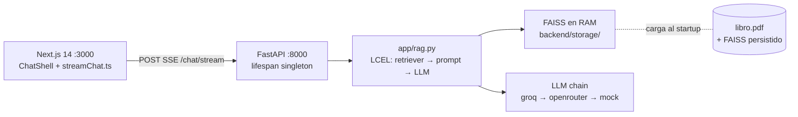

# RAG-LIBRO

RAG sobre el PDF **"30 Agents Every AI Engineer Must Build"** (Imran Ahmad): backend Python (LangChain + FastAPI) y frontend Next.js con streaming SSE.

Proyecto de portfolio con enfoque **eval-first** (`EVAL.md` + tests), APIs de LLMs gratuitos y modo offline vía `MockLLM` (adaptado del capítulo 06 del repo del libro).

**Baseline actual:** 7/10 PASS (70%) con Groq `llama-3.1-8b-instant`, `RETRIEVER_K=4` — validado en benchmark Fase A/B (2026-05-20). Detalle en `EVAL.md` § Benchmark de modelos.

## Arquitectura



**Flujo de un request streaming:**

1. UI hace `POST /chat/stream` con `{ message }` (fetch-event-source, no `EventSource` nativo).
2. FastAPI valida con Pydantic (422 si vacío) y chequea índice cargado (503 si no).
3. `rag.stream_answer_with_sources` corre **un solo** retrieval async (k=4).
4. Emite `event: sources` con páginas 1-based del top-k → la UI ya puede pintar chips.
5. Streamea `event: token` por cada chunk de `chain.astream` (LCEL real, no fake).
6. Emite `event: done` y cierra. Si el cliente aborta, el servidor detecta `is_disconnected()` y corta.

Decisiones, alternativas rechazadas y trade-offs detallados: `PROJECT_OVERVIEW.md` (gitignored).

## Estructura

```
RAG-LIBRO/
├── backend/
│   ├── app/          # Pipeline RAG, LLM router, API (fases 1–2)
│   ├── data/         # libro.pdf (gitignored)
│   ├── storage/      # índice FAISS persistido (gitignored)
│   ├── eval_runner.py # benchmark de modelos y sweep de k (Fase 1e+)
│   └── tests/        # evals automatizados (fase 0.5+)
├── frontend/         # Next.js 14 + chat SSE (fase 3)
├── EVAL.md           # 10 queries y criterios PASS/FAIL
└── .env
```

## Requisitos

- Python 3.10+
- Node.js 18+ (fase 3)

## Setup rápido (Fase 0)

```powershell
cd RAG-LIBRO\backend
python -m venv .venv
.\.venv\Scripts\Activate.ps1
pip install -r requirements.txt
copy ..\.env.example ..\.env
```

Colocá el PDF en `backend/data/libro.pdf` (ya copiado desde Downloads si ejecutaste el scaffold).

### Si moviste la carpeta del proyecto

Los scripts de `.venv` guardan la ruta absoluta del Python. Si ves `Fatal error in launcher: Unable to create process` apuntando a otra carpeta, **borrá `.venv` y recrealo** en `backend/`:

```powershell
cd RAG-LIBRO\backend
Remove-Item -Recurse -Force .venv
py -3.13 -m venv .venv
.\.venv\Scripts\Activate.ps1
python -m pip install -r requirements.txt
```

Para tests de ingestión (Fase 1a) alcanza con:

```powershell
python -m pip install python-dotenv pypdf pytest langchain langchain-core langchain-community langchain-text-splitters faiss-cpu numpy
```

Preferí `python -m pytest` en lugar de `pytest` directo (siempre usa el intérprete del venv activo).

**LLM (config recomendada, post-benchmark):**

| Variable | Valor | Notas |
|----------|-------|-------|
| `LLM_FALLBACK_CHAIN` | `groq,openrouter,mock` | Groq primero (mejor PASS en eval); OR como respaldo |
| `GROQ_MODEL` | `llama-3.1-8b-instant` | 7/10 en k=4/6/8; 70B versatile quedó en 6/10 |
| `OPENROUTER_MODEL` | `meta-llama/llama-3.3-70b-instruct:free` | Fallback; cupo free ~50 req/día |
| `OPENROUTER_MODEL_FALLBACK` | `nvidia/nemotron-3-super-120b-a12b:free` | Segundo intento dentro de OR |
| `RETRIEVER_K` | `4` | Óptimo en Fase B (k=6/8 no mejoran PASS rate) |

Ante error de API, timeout o respuesta vacía pasa al siguiente proveedor. Sin claves válidas termina en `mock`.

## Levantar la API (Fase 2)

Requiere que el índice FAISS esté construido (Fase 1 completa).

```powershell
cd RAG-LIBRO\backend
.\.venv\Scripts\Activate.ps1
uvicorn app.main:app --reload
```

- API en `http://localhost:8000`
- Docs interactivos en `http://localhost:8000/docs`

### Endpoints disponibles (Fase 2)

#### `GET /health`

```powershell
curl http://localhost:8000/health
# → {"status":"ok","index_loaded":true}
```

`index_loaded: false` indica que el índice FAISS no está en RAM. Para construirlo, corré el notebook `backend/notebooks/rag_exploration.ipynb` (Fase 1) o, en línea de comandos:

```powershell
cd RAG-LIBRO\backend
.\.venv\Scripts\Activate.ps1
python -c "from app.rag import build_or_load_vectorstore; build_or_load_vectorstore()"
```

Se persiste en `backend/storage/faiss_index/` (gitignored). En arranques posteriores, el lifespan lo carga desde disco — no se re-embedea por request.

#### `POST /chat` — respuesta sincrónica

```powershell
curl -X POST http://localhost:8000/chat `
  -H "Content-Type: application/json" `
  -d '{"message": "What is the ReAct loop?"}'
# → {"answer":"...","pages":[23,45]}
```

Parámetros del body:

| Campo | Tipo | Default | Descripción |
|-------|------|---------|-------------|
| `message` | string | requerido | Pregunta sobre el libro (mínimo 1 carácter) |
| `k` | int | `4` | Chunks a recuperar (rango 1–20; default validado en benchmark) |

#### `POST /chat/stream` — respuesta en streaming (SSE)

```powershell
curl -X POST http://localhost:8000/chat/stream `
  -H "Content-Type: application/json" `
  -d '{"message": "What is the ReAct loop?"}' `
  --no-buffer
# event: sources → event: token (×N) → event: done
```

Errores:
- **422** — payload inválido (ej. `message` vacío) — Pydantic lo valida automáticamente.
- **503** — índice FAISS no cargado — reiniciá el servidor.

### CORS

La API permite requests cross-origin desde `http://localhost:3000` (Next.js). Si desarrollás el frontend en otro puerto, agregá el origen en `app.add_middleware(CORSMiddleware, allow_origins=[...])` dentro de `backend/app/main.py`.

No uses `allow_origins=["*"]` — bloquea `allow_credentials` y abre la API a cualquier origen externo en producción.

## Frontend (Fases 3a–3e)

Interfaz de chat en **Next.js 14** (App Router + Tailwind) con **SSE real** a `POST /chat/stream` (`@microsoft/fetch-event-source`) y chips de páginas fuente.

Requisitos: Node.js 18+ **y** API en `:8000` con índice cargado.

```powershell
cd RAG-LIBRO\frontend
copy .env.example .env.local
npm install
npm run dev
```

- UI en `http://localhost:3000`
- Variable `NEXT_PUBLIC_API_URL` en `.env.local` (default `http://localhost:8000`) — se muestra en el header del chat vía `frontend/lib/api.ts`

### Qué hay hecho

| Fase | Qué es | Gate |
|------|--------|------|
| **3a** | Next 14 + `NEXT_PUBLIC_API_URL` | `npm run dev` :3000 |
| **3b** | Shell chat + estados `idle \| streaming \| done \| error` | input bloqueado en streaming |
| **3c** | Cliente SSE (`lib/streamChat.ts`) | texto crece; CORS OK |
| **3d** | `SourceBadges` bajo respuesta y durante stream | chips `p. N` |
| **3e** | Smoke E2E | `python scripts/smoke_ui_e2e.py` + checklist `CHECKLIST_E2E.md` |

### Smoke E2E (3e)

Con backend levantado:

```powershell
cd RAG-LIBRO\backend
.\.venv\Scripts\Activate.ps1
python ..\scripts\smoke_ui_e2e.py
```

Usa **Q01** de `EVAL.md` por defecto. Checklist manual UI (B1–B9) para Fase 5: [`CHECKLIST_E2E.md`](CHECKLIST_E2E.md).

### Estados del chat

| Estado | Significado |
|--------|-------------|
| `idle` | Listo |
| `streaming` | SSE activo; badges de páginas + preview con cursor |
| `done` | Respuesta en historial con `pages` |
| `error` | Fallo de red/API (mensaje en header) |

### Estructura del frontend

```
frontend/
├── components/
│   ├── ChatShell.tsx       # Orquesta SSE + mensajes
│   ├── MessageList.tsx     # Burbujas + preview streaming
│   ├── SourceBadges.tsx    # Chips p. N (3d)
│   └── …
└── lib/
    ├── streamChat.ts       # fetch-event-source (3c)
    └── chat.ts
```

## Evaluación y benchmark de modelos

Golden set de 10 queries en `EVAL.md` (criterios A: retrieval, B: generación). Correr desde `backend/`:

```powershell
.\.venv\Scripts\Activate.ps1
# Suite completa (default: k=4, cadena del .env)
python eval_runner.py

# Benchmark: otro modelo / proveedor y guardar en EVAL.md
python eval_runner.py --k 4 --groq-model llama-3.1-8b-instant --chain groq --save-results

# Profiling de k (delay auto-escala con k para límite TPM de Groq)
python eval_runner.py --k 4 6 8 --chain groq --save-results

# Smoke: una query (Q01) para validar disponibilidad sin gastar cupo
python eval_runner.py --smoke --openrouter-model meta-llama/llama-3.3-70b-instruct:free --chain openrouter
```

Flags útiles: `--groq-model`, `--openrouter-model`, `--chain`, `--smoke`, `--save-results`, `--delay`, `--inter-k-pause`.

## Validación end-to-end (Fase 5)

Suite consolidada de regresión y smokes. Pensada para correr antes de un release/demo y como evidencia de portfolio.

### 1. Regresión backend (offline, sin claves)

```powershell
cd RAG-LIBRO\backend
.\.venv\Scripts\Activate.ps1
python -m pytest tests/ -v -m "not integration"
```

> **Última corrida (2026-05-20):** 55 passed, 10 deselected, 3 warnings — 92.8 s.
> Cubre ingestión, vectorstore, RAG core, LLM fallback, MockLLM, API (health/chat/stream con 422/503) y dataset de eval.

### 2. Eval integración con LLM real (PASS ≥ 70%)

Requiere `.env` con `GROQ_API_KEY` válida (o cadena alternativa).

```powershell
python -m pytest tests/test_eval.py -v -m integration
# Equivalente con detalle por query:
python eval_runner.py
```

Baseline esperada: 7/10 (Groq 8B, k=4). Cualquier corrida nueva debe registrarse en `EVAL.md` § Registro.

### 3. Smoke E2E del contrato SSE (API + protocolo)

Con backend levantado en `:8000` e índice cargado:

```powershell
python ..\scripts\smoke_ui_e2e.py
# Otra query del golden set:
python ..\scripts\smoke_ui_e2e.py --query-id Q03
```

Valida: `/health.index_loaded=true`, evento `sources` con ints, ≥1 token, `done` final, respuesta ≥ 20 chars.

### 4. Smoke manual UI (B1–B9)

Levantar API + UI y seguir el checklist B en `CHECKLIST_E2E.md`. No puede automatizarse sin Playwright — se verifica a ojo y se anota en el registro del propio checklist.

### 5. Documentación interactiva

```powershell
# Backend corriendo:
start http://localhost:8000/docs    # Swagger UI
start http://localhost:8000/redoc   # ReDoc
```

### Resumen

| # | Item | Estado |
|---|------|--------|
| 1 | `pytest -m "not integration"` (55 tests) | ✓ 2026-05-20 |
| 2 | `pytest -m integration` ≥ 70% | ✓ 7/10 (`EVAL.md` § Registro) |
| 3 | `smoke_ui_e2e.py` Q01 | ✓ `CHECKLIST_E2E.md` § Registro smoke 3e |
| 4 | Checklist B1–B9 UI | Manual — al hacer demo |
| 5 | `/docs` revisado | Manual — al hacer demo |

## Roadmap

| Fase | Entregable | Estado |
|------|------------|--------|
| 0 | Scaffold | ✓ |
| 0.5 | `EVAL.md` + `test_eval.py` | ✓ |
| 1 | Notebook RAG, FAISS, `rag.py`, eval ≥70% | ✓ (7/10) |
| 1e+ | `eval_runner.py`, benchmark modelos (Fase A/B) | ✓ |
| 2 | FastAPI `/health`, `/chat`, `/chat/stream`, tests API | ✓ |
| 3a | Next.js 14 scaffold + `NEXT_PUBLIC_API_URL` | ✓ |
| 3b | Shell del chat (layout + estados idle/streaming/done/error) | ✓ |
| 3c–3e | Cliente SSE, badges, smoke E2E + `CHECKLIST_E2E.md` | ✓ |
| 4 | `PROJECT_OVERVIEW.md` (gitignored, defensa técnica) | ✓ |
| 5 | E2E + pulido portfolio (regresión 55/55, README arquitectura) | ✓ |

## Defensa técnica (Fase 4)

`PROJECT_OVERVIEW.md` en la raíz del proyecto (gitignored) documenta ADRs, trade-offs, límites medidos y plan de escalado. Uso: entrevistas y decisiones futuras — mantenerlo al día cuando cambies k, modelo o protocolo SSE.

## Referencias

- Libro / repo: `30-Agents-Every-AI-Engineer-Must-Build`
- Cap. 06 — RAG y mocks: `chapter06/agent_utils.py`
- Defensa interna: `PROJECT_OVERVIEW.md` (local, no en git)
